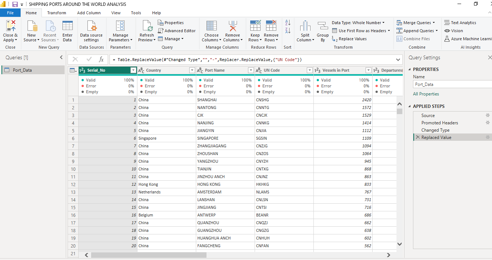
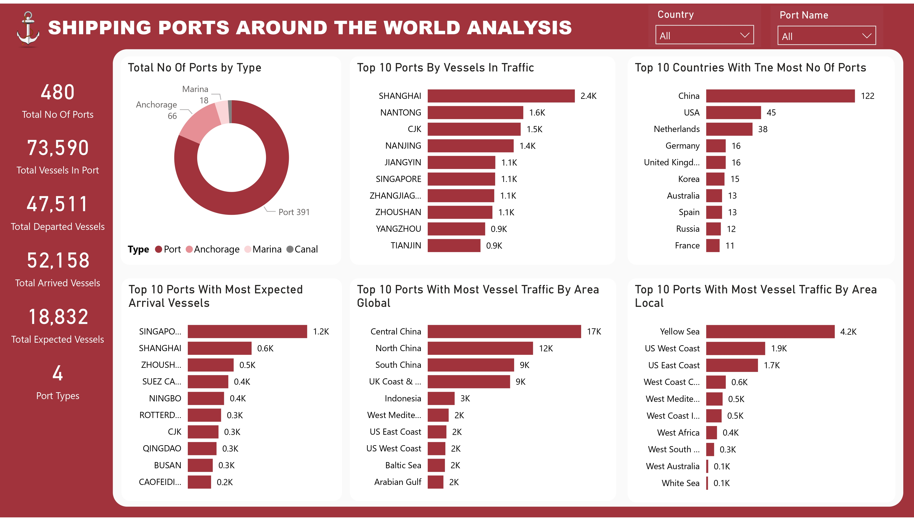
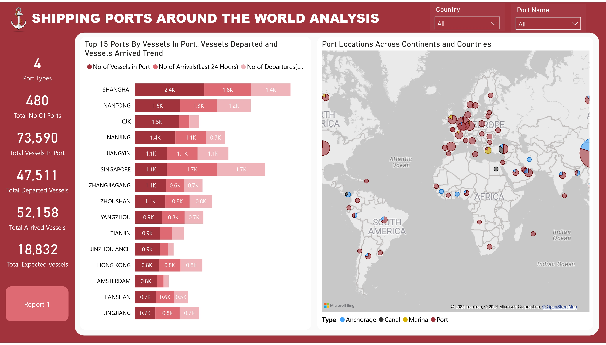
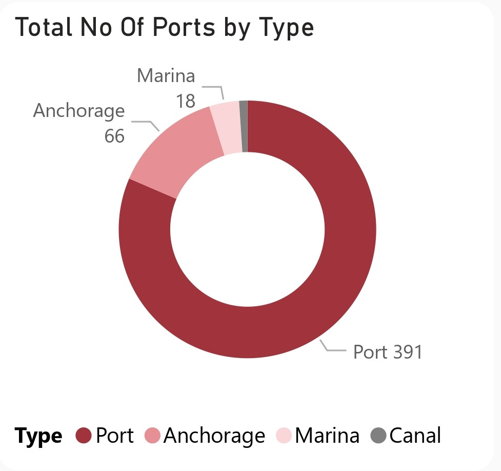
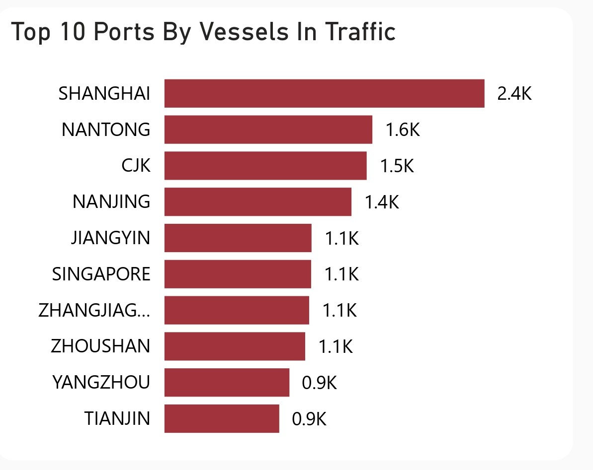
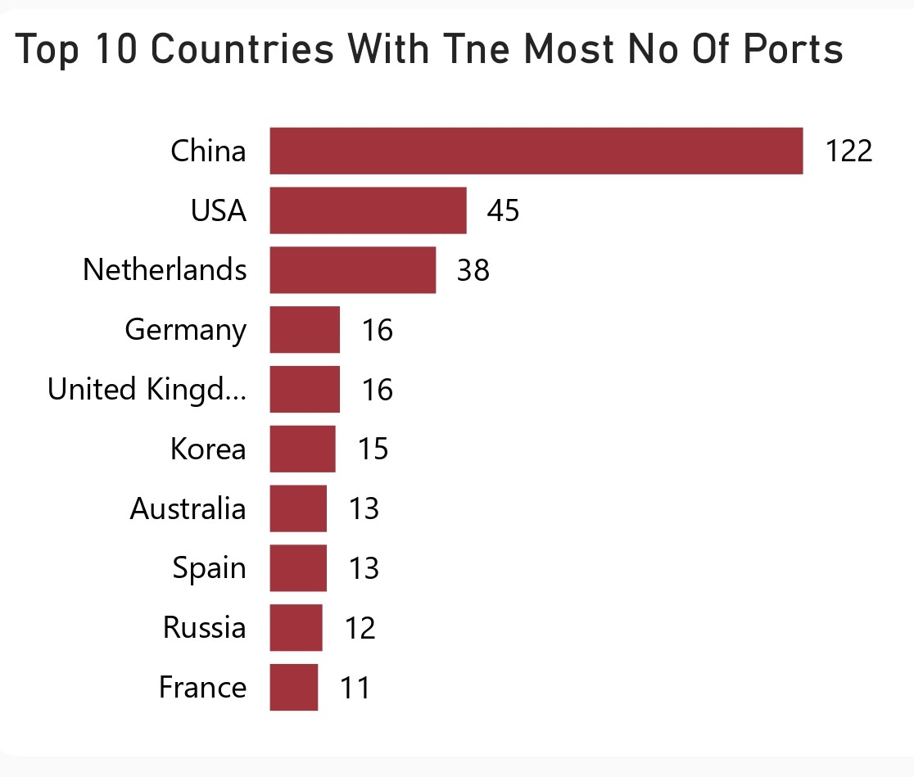
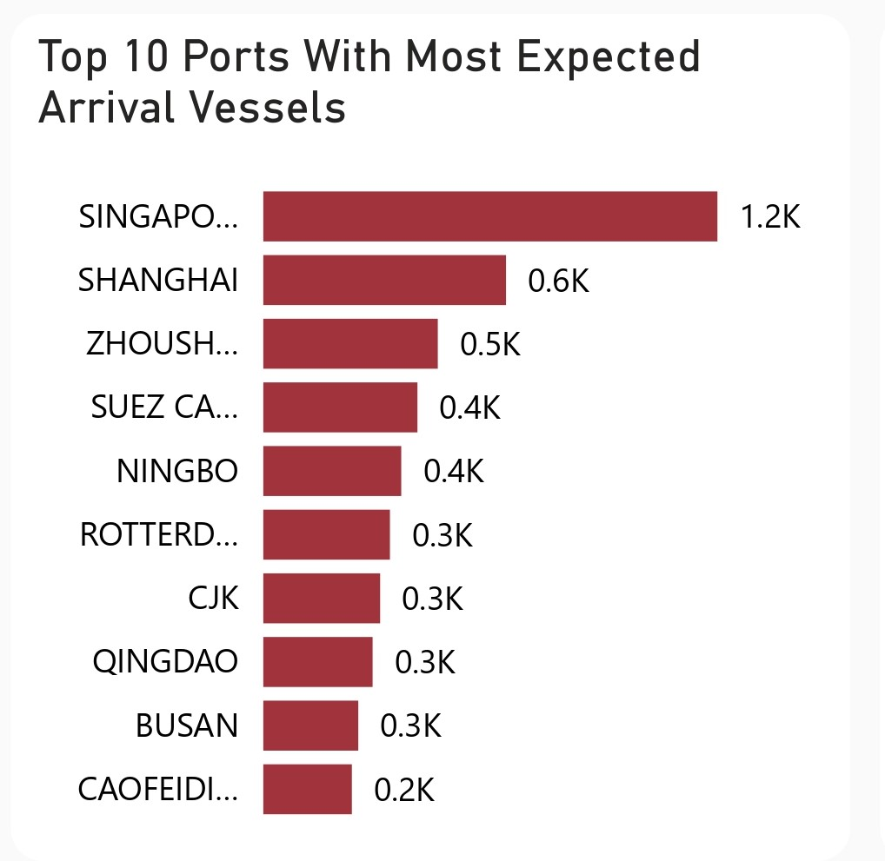
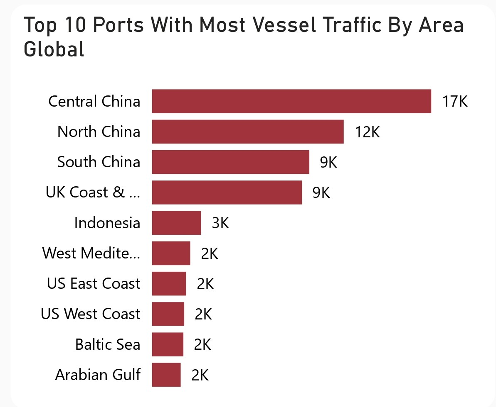
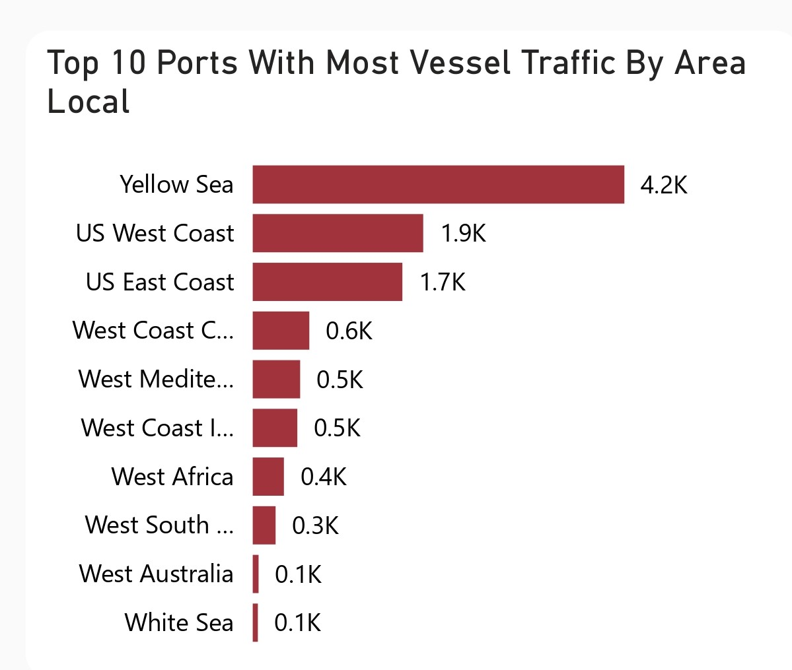
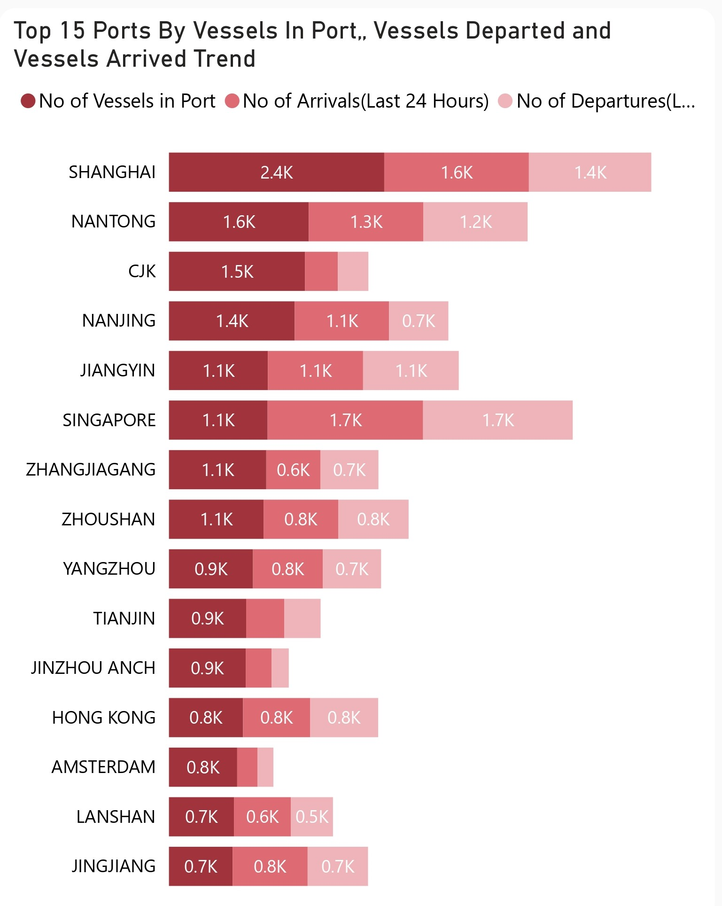

# Shipping Ports Around The World Analysis

 

## Table of Contents
- [Project Overview](#project-overview)
- [Dataset Overview](#dataset-overview)
- [Tools Used](#tools-used)
- [Visualization in Power BI](#visualization-in-power-bi)
- [Project Analysis](#project-analysis)
- [Visuals in Power BI Report](#visuals-in-power-bi-report)
- [Recommendations For Improving The Efficiency of Shipping Port Services Globally:](#recommendations-for-improving-the-efficiency-of-shipping-port-services-globally)
 

## Project Overview

### Introduction:
The question has evolved over the years with the advancement of maritime operations and the changing in the needs of the stakeholders. Today, the function of a seaport is entirely different from what it used to perform a few decades back. Seismic changes like the rise of China as a manufacturing powerhouse have significantly modified the industry. But the most significant difference is in the function that the seaports are now performing in the broader global economy. There once was the time that a seaport would be just a place to unload or load wares from a vessel. Seaports today are part of essentially any manufacturer's supply chain plan and are ranked for maybe the amount of automation equipment on the port, the skill of the workforce, its access to key markets, and the depth of its berth. Increasingly, it is data – and the ability of a seaport to process and share it among stakeholders – which supply chain companies are demanding. Of course, this raises another series of questions, including 'What is a smart port? ' Often but not always sited on a seacoast or estuary, some ports can be located miles inland, access to the sea being provided by means of a river or canal. An inland port may also be that which is located on a lake, river, or canal going to a sea or ocean. Ports can also be referred to as a harbour. 

The "Shipping Ports Around the World Analysis" is a project executed through the collection of information on the port country, traffic volume, name of the port, types of the port, UN Code, volume of vessels in ports, their geographical spread, and operational performance.

### Objectives:
- Determine the total number of ports worldwide categorized by type to provide an overview of global port infrastructure.
- Identify the top 10 ports with the highest number of vessels in traffic to pinpoint major maritime hubs and assess their significance in global shipping networks.
- Determine the top 10 countries with the most number of ports to understand regional variations in port infrastructure and maritime connectivity.
- Identify the top 10 ports with the most expected arrival vessels to understand the busiest ports in terms of incoming maritime traffic.
- Determine the top 10 ports with the most traffic by area globally to gain insights into the spatial distribution and magnitude of maritime activities on a global scale.
- Identify the top 10 ports with the most traffic by area locally to understand regional variations in port activity and traffic distribution.
- Examine the trends of the top 20 ports over time, including vessels in port, vessels departed, and vessels arrived, to identify patterns, fluctuations, and growth trajectories in maritime activities.
- Create a geospatial map illustrating the locations of ports across continents to visualize the global distribution of port infrastructure and its relationship with geographical features.

### Deliverables:
- I will render a summary of the total number of ports worldwide by type, providing insights into the composition and distribution of global port infrastructure.
- Will list of the top 10 ports by vessels in traffic, along with relevant statistics and analysis highlighting their importance in global maritime transportation.
- Will identify the top 10 countries with the most number of ports, accompanied by analysis showing regional disparities and maritime connectivity.
- Will render a compilation of the top 10 ports with the most expected arrival vessels, offering insights into the busiest ports in terms of incoming maritime traffic.
- Will analyze the top 10 ports with the most traffic by area globally, providing insights into spatial distribution and magnitude of maritime activities.
- Will analyze the top 10 ports with the most traffic by area locally, offering insights into regional variations in port activity and traffic distribution.
- Will create an analysis of traffic trends for the top 20 ports, presenting visualizations and interpretations of vessels in port, vessels departed, and vessels arrived over time to discern patterns and growth trajectories.
- Will generate an interactive map showcasing the locations of ports across continents, providing a visual representation of global port infrastructure and its spatial distribution.
 
 

### Dataset Overview
This dataset containing useful data of 450+ ports around the world. The dataset comprises of vital information crucial for a deep insight into the locations and operations of shipping ports around the world. It includes fields such as Serial_No, Country, Port Name, UN Code, Vessels in Port, Departures(Last 24 Hours), Arrivals(Last 24 Hours), Expected Arrivals, Type, Area Local, Area Global, and Also known as. By analyzing this dataset, we aim to uncover ports type, location, arrival and departure traffic volume, and more.

This dataset is a CSV file made up of a single table named Ports_Data and was provided by [Quantum Analytics](https://www.quantumanalyticsco.org/). You can click on this [link](Port_Data.csv) to preview the raw data file. This dataset table is made up of 12 fields and 480 rows of ports data.

Below are some information on the fields we have in this dataset for a better understanding of this analysis:
| Table                              | Field                    | Description                            |            
|:-----------------------------------|:------------------------ |:-------------------------------------- |
|Port_Data.csv                       | Serial_No                | This field represents a unique identifier or serial number assigned to each entry or row in the dataset. It serves as a reference number for tracking and organizing the data.    |
|                                    | Country                  | This field indicates the country in which the port is located. It provides information about the geographical location or jurisdiction of the port.     |
|                                    | Port Name                | This field contains the name or designation of the port. It identifies the specific port within the country and serves as a label for referencing and distinguishing between different ports.         |
|                                    | UN Code                  | The UN Code is a unique identifier assigned to each port by the United Nations (UN). It provides a standardized code for identifying ports internationally, facilitating communication and data exchange across different systems and organizations.         |
|                                    | Vessels in Port          | This field represents the number of vessels currently present at the port. It indicates the level of maritime activity and congestion at the port at a given point in time.       |
|                                    | Departures (Last 24 Hours)| This field indicates the number of vessels that have departed from the port within the last 24 hours. It provides information about recent outbound maritime traffic from the port.       |
|                                    | Arrivals (Last 24 Hours) | This field indicates the number of vessels that have arrived at the port within the last 24 hours. It provides information about recent inbound maritime traffic to the port.        |
|                                    | Expected Arrivals        | This field indicates the number of vessels expected to arrive at the port within a specified time frame, typically within the next few days. It provides advance notice of incoming maritime traffic and helps port authorities and stakeholders plan and manage port operations effectively.        |
|                                    |Type                      |This field categorizes the port based on its primary function or specialization. Common port types that were provided in this analysis are ports, anchorage, marina and canal         |
|                                    | Area Local               | This field refer to the local geographical area or region in which the port is situated. It provides additional context about the port's location within its immediate surroundings.         |
|                                    | Area Global              | This field refer to the global geographical region or area to which the port belongs. It provides information about the port's broader geographical context and its connection to global maritime networks.|
|                                    | Also known as            | This field contain alternative names or aliases for the port. It provides additional information about how the port may be referred to in different contexts or languages.         |
 

### Skills Utilized
1. Data Cleaning
2. Data Modelling
3. Data Visualiziation
4. Descriptive Analytics
5. Analytical Thinking and Problem Solving
6. Communication and Reporting
 

### Tools Used
1. Power Query Editor
    - Was used to:
        1. Extract,
        2. Clean,
        3. Transform all the datasets for this analysis.
           
2. Power BI (Was used to create reports and dashboard for this analysis)
    - The following Power BI Features were incorporated:
        1. DAX
        2. Quick Measures
        3. Page Navigation
        4. Filters
        5. Tooltips
        6. Button
 

### Data Cleaning and Transformation in MS Sql Server:
1. Checked to confirm all data types.
2. Was able to find online most of the missing values of the __UN Code__ column and filled them up with the help of the __Country__ and __Port Name__ column details provided.
3. Was able to find online the missing __Country__ column details with the aid of the __Port Name__ and __UN Code__ details provided.
4. Used __-__ (hyphen) for the __UN Code__ details that couldsn't be found.
5. Changed all data types of the fields in the table to the right data type.
 

**Power Query View**

Power Query Screenshot                                                             |                                
:---------------------------------------------------------------------------------:|

You can access the complete Power BI project document [here](SHIPPING%20PORTS%20AROUND%20THE%20WORLD%20ANALYSIS.pbix).
 
 

## Data Modelling
No data modelling was required since we needed just a table for the analysis.
 
 

## Visualization in Power BI:
#### Report View 1

#### Report View 2

 
 

### Project Analysis:
From the analysis, i made the Key findings below:
- Number of Port Types: __4.__
- The Total Number of Ports: __480.__
- The Total Vessels In Port: __73,590.__
- Total Arrived Vessels: __52,158.__
- Total Expected Vessels: __18,832.__
 
 

- 

- **Total Number of Ports By Type:**
- In this analysis of the Total Number of Ports By Type, I was able to come up with the following insights
- __Port Type Distribution:__ The dataset provides a breakdown of port types. It includes Port, Anchorage Marina, and Canal. The majority of the entries fall under category of traditional __"Ports,"__ constituting approximately 81.46% of total. __"Anchorage"__ comes next. It represents 13.75% of the total indicating significant presence of locations where vessels anchor rather than dock. __"Marina"__ and __"Canal"__ types contribute relatively smaller percentages, accounting for 3.75% and 1.04% respectively
- __Implications of Port Types:__ The dominance of traditional "Ports" suggests substantial infrastructure dedicated to handling various types of cargo. It facilitates maritime trade. A notable presence of "Anchorage" indicates areas where vessels anchor. This may occur for short stays or as waiting points before entering busier ports. The presence of "Marinas" highlights areas designed for recreational boating. It possibly includes tourism-related maritime activities. "Canals" although smaller percentage, may represent critical waterways designed for navigation and transportation purposes
 
 

- 

- **Top 10 Ports By Vessels In Traffic:**
- In this analysis of Top 10 Ports By Vessels In Traffic I came up with below insights  
- __Shanghai Dominates Vessel Traffic:__ Shanghai appears to be leading port in the area of vessel traffic. It has a substantial count of 2420 vessels in port. This dominance highlights Shanghai's strategic importance. It serves as a major hub for maritime transportation and trade in the region  
- __Significance of Chinese Ports:__ Chinese ports feature prominently in top 10 list. Ports like Nantong CJK, Nanjing Jiangyin Zhangjiagang Zhoushan and Yangzhou all made a mark. This underscores China's role as key player in the global shipping industry. Several ports handle significant volumes of vessel traffic  
- __Regional Influence:__ The presence of ports like Singapore and Tianjin in top 10 list indicates the regional significance of these maritime hubs. Singapore is known for its strategic location and world-class port facilities. It serves as a crucial gateway to Asia and beyond. Tianjin, located in northern China is vital port for trade in the Bohai Bay region and beyond
- __Implications for Trade and Commerce:__ High volume of vessel traffic in these ports reflects intense economic activity and trade flows in their respective regions. Ports with high vessel traffic likely have robust infrastructure. They possess logistics capabilities. They handle influx of ships and cargo efficiently. Stakeholders involved in global trade and logistics can use this information for optimizie supply chain routes and operations
 
 

- 

- **The Top 10 Countries With The Most Number of Ports:**
- In this analysis of the Top 10 Countries with the Most Number of Ports the details below give us insights into this analysis  
- __China Leads in Port Density:__ China emerges as country with highest number of ports, boasting a total of 122 ports. This dominance underscores China's vast coastline. It also reflects its strategic focus on maritime trade and transportation  
- __Variety of Port Facilities in USA:__ USA ranks second with 45 ports. This reflects its extensive coastline along Atlantic Pacific and Gulf coasts. USA's ports cater to diverse needs, including container shipping bulk cargo, oil terminals, and passenger terminals  
- __European Presence:__ European countries like Netherlands Germany and the United Kingdom feature prominently in the top 10 list. The Netherlands, with 38 ports is known for its world-class port infrastructure and strategic location in Europe  
- __Global Maritime Hubs:__ Countries like Korea, Australia Spain, and Russia also make the top 10 list. This highlights their importance as global maritime hubs. These countries serve as critical nodes in international trade routes. They facilitate the movement of goods and commodities
- __Strategic Importance of Ports:__ The presence of large number of ports in these countries reflects their strategic importance in global maritime logistics. Ports play a crucial role in supporting economic growth. They facilitate trade. They connect countries to international markets.
 
 

- 

- **The Top 10 Ports With The Most Expected Arrival Vessels:**
- Here are the top 10 Ports With Most Expected Arrival Vessels:
- __Singapore on Top:__ Singapore has the most expected arrival vessels with 1203. Singapore is a major global maritime player and a key stopover for ships on major shipping lanes.
- __Chinese Ports Rule:__ Chinese ports – Shanghai Zhoushan, Ningbo CJK, Qingdao, Caofeidian make it to the top 10. China is getting bigger in shipping and its ports are crucial for international trade.
- __Why Suez Canal:__ The Suez Canal’s presence in the list means it’s a vital link between the Mediterranean and the Red Sea. It’s a trade route between Europe and Asia.409 expected vessels mean the canal is a major maritime highway.
- __European Presence in Rotterdam:__ Rotterdam in the Netherlands is the biggest port in Europe and a key gateway to the continent.336 expected arrival vessels means Rotterdam is a major maritime hub in Europe and a node in global trade.
- __Asian Ports of Busan:__ Busan in South Korea is a major port in East Asia. It’s a key hub for maritime trade in the region.252 expected arrival vessels mean that Busan is a transshipment hub and gateway to Northeast Asia.
- __Trade and Logistics Implications:__ The high number of expected arrival vessels in these ports means there’s a lot of economic activity and trade in their regions. Port authorities and logistics players can use this to anticipate vessel traffic. Plan port operations and resources accordingly
 
 

- 

- **The Top 10 Ports With The Most Vessel Traffic By Area Global:**
- In this analysis, I created some insights about The Top 10 Ports With The Most Vessel Traffic By Area Global. Details are as follows:
- __Central China Dominance:__ With a count of 16,790 vessels in port, Central China turns out to be the region with the highest vessel traffic. It is evidence of the centrality of the central Chinese ports as hubs for sea transportation and commerce activities within the region.
- __Variation in Traffic Across Chinese Regions:__ That North China and South China have been included in the top 10 identifies the indispensable position of the two regions within the Chinese sea freight industry. North China and South China are the main economic areas and are locations for key harbors dealing with enormous volumes of cargo and container traffic with 11,526 and 9,457 vessels in port, respectively.
- __Strategic Position of the UK Coast & Atlantic:__ Inclusion of UK Coast & Atlantic in the top 10 list with a total of 9017 vessels at port supposes a strategic position of the ports along the coastline of the UK and the Atlantic Ocean. These are the ports that offer access both to Europe and to the North Atlantic, thus linking the UK with Europe and North America in terms of trade.
- __Maritime Significance of Indonesia_: With 2,946 vessels in port, Indonesia's inclusion on the list underscores its significance as a maritime nation, spanning an expansive archipelago with too many ports dotting its many different islands. Indonesian ports form a significant part of facilitating domestic and regional trade, connecting the different islands, and acting as transshipment hubs.
- __Mediterranean and Baltic Sea Traffic:__ Also in the top 10 are the West Mediterranean and Baltic Sea, which only typify the large maritime traffic in these European key waterways. The ports in these regions play a major role in nodes of sea-based trade networks in Europe and help connect the Mediterranean Sea to the Atlantic Ocean and the Baltic Sea to the North Sea.
– __US Coastline Traffic Distribution:__ The US East Coast and US West Coast featured in the top 10 list with 2,046 and 1,931 vessels in port, respectively, underpinning the volume of sea traffic in ports along the length of the US coastline. US East Coast and West Coast ports provide critical gateways for transatlantic and transpacific trade, respectively, for the US into global markets.
- __Arabian Gulf's Role in Global Trade:__ The Arabian Gulf region with 1,718 vessels in port, represented by ports in countries like UAE, Saudi Arabia, and Qatar, features in the top 10 list, reflecting its significance as a key maritime hub in the Middle East. Ports in the Arabian Gulf serve as vital nodes in global trade routes, connecting Asia, Europe, and Africa.
 
 

- 

- **The Top 10 Ports With The Most Vessel Traffic By Area Local:**
- Below is an analysis of the top 10 ports with the most vessel traffic by area local:
- __Yellow Sea Dominance:__ According to this data, the Yellow Sea is the area with the most vessel traffic, recording a high count of 4,210 vessels in port. This is an underpin on the Yellow Sea's significance as a major maritime thoroughfare that links China, South Korea, and North Korea.
- __US Coastlines Second and Third in Rankings:__  US West Coast and US East Coast take second and third place with 1,931 and 1,695 vessels, respectively, in regard to vessel traffic within the locales. They form the very core of sea-based gateways that service maritime commerce between the US and Asia, Europe, and other parts of the world.
- __Importance of West Coast Canada:__ West Coast Canada ranked fourth on the list at 841 vessels in port, representing all the ports in British Columbia. Ports in this region play a significant role in acting as main hubs for trade between Canada, Asia, and the countries of the Pacific Rim.
- __Mediterranean and Indian Coasts Presence:__ The areas of West Mediterranean and West Coast India, with 537 and 505 vessels in port, respectively, are also within the top 10 list, underpinning their significance in regional sea trade. These areas form vital nodes in global shipping routes, linking Europe to the Middle East, Africa, and Asia.
- __West Africa and South America Representation:__ The vessel traffic in West Africa and West South America is 353 and 259 vessels, respectively, in port, indicating that these regions have ports relevant for trade and commerce. In West Africa and South America, the role of their ports is crucial for trade flows to and from these regions with the rest of the world.
- __Lower Traffic in West Australia and the White Sea:__ In comparison, West Australia and the White Sea have lower vessel traffic, with 66 and 58 vessels in port, respectively.
These areas may have fewer number of ports or lower trade volumes compared to other areas; however, they play their part in local and regional economies.
 
 

- 

- **Top 15 Ports By Vessels In Port, Vessels Departed and Vessels Arrived:**
- Below are the top 15 ports by vessels in port, vessels departed, and vessels arrived. The details below help us in getting insights into this analysis.
- __Shanghai Dominant Across Metrics:_ Shanghai is the outright leader across all metrics, topping vessels in port, arrivals, and departures. With 2,420, 1,626, and 1,376 vessels respectively, this underlines the status of Shanghai as a major global maritime hub and a critical node in international trade routes.
- __Regional Trends in China:__ The Chinese ports in the top 15 include Nantong, CJK, Nanjing, Jiangyin, Zhangjiagang, and Zhoushan. All of these illustrate the domination of China in the industry, where many of its country's ports handle enormous vessel traffic.
- __Singapore as an International Hub:__ Singapore is ranked among the best ports in terms of vessels in port, arrivals, and departures, accounting for 1,109, 1,748, and 1,682 vessels respectively. This places the country at par as one of the vital maritime centers in Southeast Asia. A strategic geographical position, world-class infrastructure, and efficient port operations set Singapore very prominent across global trade and logistics.
- __Variety of Port Functions:__ In the process, many vessels visit the ports of Tianjin, Jinzhou Anch, and Hong Kong, thereby trying to prove their importance in regional and international trade.
Several individual ports may vary in function or tend to be better suited to handling particular cargoes or operating as transshipment hubs.
- __European Ports in the Mix:__ The top 15 also feature European ports, including Amsterdam, with 767 vessels in port, 228 arrivals, and 179 departures. What this has done is emphasize the central role these European ports will play insofar as trade between Europe, Asia, and the rest of the world is concerned. European ports occupy a unique position, and with their effective logistics networks and well-developed infrastructure, they continue to attract vessel traffic in support of global trade flows.
 
 

- 

- **Port Locations Across Continents and Countries:**
- The geospatial map showing the locations of ports, countries, port types, the number of ports and vessels at port provides great insight into the "Shipping Ports Around The World Analysis. Here's the analysis details:
- __Visualizing Global Port Infrastructure:__ The geospatial map creates a visualization of the port infrastructure across continents and countries. It provides an intuitive sense of how the ports are spatially distributed, with clustering in different regions.
- __Identification of Continental and Country-Level Port Distribution:__ The map will let us identify the highly concentrated regions of ports, normally being the coastal areas and major river deltas.
- __Types of Ports and Their Distribution:__ We can visualize the diversity of port types, like port, canal, marina, and anchorage. Knowing the distribution of types lets us know how different kinds of functions and roles the ports perform in facilitating sea trade and transportation.
- __Quantification of Port Infrastructure:__ This map shows the port infrastructure in terms of the number of ports that a country or region has. This is quantitative data, which describes the extent of maritime infrastructure and the reach of maritime activity across different parts of the world.
- __Vessel Activity Assessment:__ Except for the seaport infrastructure, this map represents the vessel count in a port and captures an overview of the kind of maritime traffic and level of activity. Big numbers of vessels seen in some of the more famous ports reflect significant trade volumes, showing strong economic activities and strategic positions.
 
 

## Visuals in Power BI Report:
You can view and interact with this dashboard report [here](https://app.powerbi.com/view?r=eyJrIjoiOWQ0ZDM3NTctMWY0Zi00ZTk1LWFhNmItZmFmYjZkNzJlY2I0IiwidCI6IjdlYzI5NjU5LTNjZjItNGYzZi1hYmIzLWE3MjJlZGY3ZmYyZCJ9).
 
 
 

## Recommendations For Improving The Efficiency of Shipping Port Services Globally:
- __Infrastructure Investment:__ Governments and port authorities have to make investments in port infrastructure to increase its capacity and efficiency. It would mean terminal expansion, modernization of equipment, and deepening of navigational channels to accommodate larger-sized vessels.
- __Advanced Technologies:__ Advanced technologies such as automation, IoT, and AI can make a difference in smoothening operations at the ports and bring in efficiencies in cargo handling processes to shorten the turn-around time of vessels.
- __Improved Intermodal Connectivity:__ Intermodal connectivity between the ports and hinterland road, rail, and inland waterways networks needs to be improved for smooth evacuation of cargo and decongestion of the area in and around the ports.
- __Port Community Systems to Be Implemented:__ PCS implementation will enhance the electronic exchange of data and information between all stakeholders, who include shipping lines, terminal operators, customs, and logistics providers. This enhances the efficient flow of information and the coordination of operations in ports.
- __Optimize Berth Allocation:__ This is a prediction-based berth scheduling and allocation system that can be implemented with predictive analytics, wherein real-time data is used to enhance the efficiency of vessel traffic management, reducing idle time for ships and increasing berth utilization.
- __Facilitate Collaboration and Partnerships:__ Organize collaboration and partnerships between the different stakeholders at the port, public and private entities, shipping lines, terminal operators, and logistic providers toward problem-solving, sharing best practices, and operation efficiency improvement at the port.
- __Training and Workforce Development:__ Organize some training programs or skill development activities to enhance the competencies of port personnel in handling modern port equipment, digital technologies, and best practices in various aspects of port operations and management.
- __Contingency Plans Development:__ Elaborate on the contingency plans and risk management strategies that might help reduce the impact on port operations in case disasters, pandemics, or other geopolitical events occur, and ensure business continuity.
 
 

## Thank You For Following Through!

