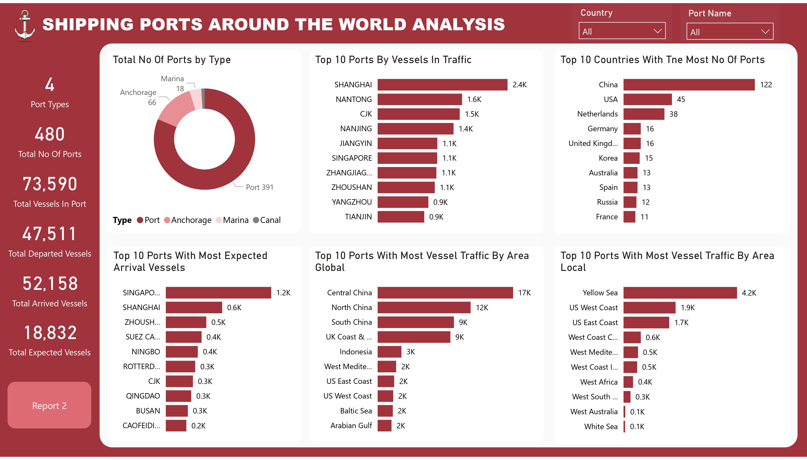

# Shipping Ports Around The World Analysis

## Project Overview

### Introduction:
The question has changed over time as maritime operations have improved and stakeholders’ needs have altered. Today, a seaport serves different functions than what it did for several decades. Seismic changes, such as the growth of China as a manufacturing giant, have substantially changed the industry. But the biggest difference is the role that seaports now play in the wider global economy. Time was that a seaport would simply be a place to unload or load goods from a vessel. Today, seaports are central to any manufacturer’s supply chain plan and are ranked based on several aspects. These could be the amount of automation equipment they possess, the skill of their workforce, its access to key markets, and the depth of its berth.
Increasingly, data and the ability of a seaport to process and share it among stakeholders is what supply chain companies are looking for. This then raises a further set of questions, such as ‘What is a smart port?’ Although frequently located on a seacoast or estuary, some ports can be situated miles inland, with access to the sea via river or canal. If a port is located on a lake, river, or canal that goes to a sea or ocean, that port can be defined as an inland port. Ports can also be called a harbor.

The "Shipping Ports Around The World Analysis" project aims to provide insights into the global shipping industry by analyzing data related to shipping ports worldwide. The project will involve gathering, processing, and analyzing data pertaining to various aspects of shipping ports, including port country, traffic volume, port name, port types, UN Code, vessels volume in ports, geographical distribution, and operational efficiency. 

### Objectives:
- Determine the total number of ports worldwide categorized by type to provide an overview of global port infrastructure.
- Identify the top 10 ports with the highest number of vessels in traffic to pinpoint major maritime hubs and assess their significance in global shipping networks.
- Determine the top 10 countries with the most number of ports to understand regional variations in port infrastructure and maritime connectivity.
- Identify the top 10 ports with the most expected arrival vessels to understand the busiest ports in terms of incoming maritime traffic.
- Determine the top 10 ports with the most traffic by area globally to gain insights into the spatial distribution and magnitude of maritime activities on a global scale.
- Identify the top 10 ports with the most traffic by area locally to understand regional variations in port activity and traffic distribution.
- Examine the trends of the top 20 ports over time, including vessels in port, vessels departed, and vessels arrived, to identify patterns, fluctuations, and growth trajectories in maritime activities.
- Create a geospatial map illustrating the locations of ports across continents to visualize the global distribution of port infrastructure and its relationship with geographical features.

### Deliverables:
- I will render a summary of the total number of ports worldwide by type, providing insights into the composition and distribution of global port infrastructure.
- Will list of the top 10 ports by vessels in traffic, along with relevant statistics and analysis highlighting their importance in global maritime transportation.
- Will identify the top 10 countries with the most number of ports, accompanied by analysis showing regional disparities and maritime connectivity.
- Will render a compilation of the top 10 ports with the most expected arrival vessels, offering insights into the busiest ports in terms of incoming maritime traffic.
- Will analyze the top 10 ports with the most traffic by area globally, providing insights into spatial distribution and magnitude of maritime activities.
- Will analyze the top 10 ports with the most traffic by area locally, offering insights into regional variations in port activity and traffic distribution.
- Will create an analysis of traffic trends for the top 20 ports, presenting visualizations and interpretations of vessels in port, vessels departed, and vessels arrived over time to discern patterns and growth trajectories.
- Will generate an interactive map showcasing the locations of ports across continents, providing a visual representation of global port infrastructure and its spatial distribution.

### Dataset Overview
This dataset containing useful data of 450+ ports around the world. The dataset comprises of vital information crucial for a deep insight into the locations and operations of shipping ports around the world. It includes fields such as Serial_No, Country, Port Name, UN Code, Vessels in Port, Departures(Last 24 Hours), Arrivals(Last 24 Hours), Expected Arrivals, Type, Area Local, Area Global, and Also known as. By analyzing this dataset, we aim to uncoverports type, location, arrival and departure traffic volume, and more.

This dataset is a CSV file made up of a single table named Ports_Data and was provided by [Quantum Analytics](https://www.quantumanalyticsco.org/). You can click on this [link](Shipping-Ports-Around-The-World-Analysis/blob/main/Port_Data.csv) to preview the raw data file. This dataset table is made up of 12 fields and 480 rows of ports data.

Below are some information on the fields we have in this dataset for a better understanding of this analysis:
- __Serial_No:__ This field represents a unique identifier or serial number assigned to each entry or row in the dataset. It serves as a reference number for tracking and organizing the data.
- __Country:__ This field indicates the country in which the port is located. It provides information about the geographical location or jurisdiction of the port.
- __Port Name:__ This field contains the name or designation of the port. It identifies the specific port within the country and serves as a label for referencing and distinguishing between different ports.
- __UN Code:__ The UN Code is a unique identifier assigned to each port by the United Nations (UN). It provides a standardized code for identifying ports internationally, facilitating communication and data exchange across different systems and organizations.
- __Vessels in Port:__ This field represents the number of vessels currently present at the port. It indicates the level of maritime activity and congestion at the port at a given point in time.
- __Departures (Last 24 Hours):__ This field indicates the number of vessels that have departed from the port within the last 24 hours. It provides information about recent outbound maritime traffic from the port.
- __Arrivals (Last 24 Hours):__ This field indicates the number of vessels that have arrived at the port within the last 24 hours. It provides information about recent inbound maritime traffic to the port.
- __Expected Arrivals:__ This field indicates the number of vessels expected to arrive at the port within a specified time frame, typically within the next few days. It provides advance notice of incoming maritime traffic and helps port authorities and stakeholders plan and manage port operations effectively.
- __Type:__ This field categorizes the port based on its primary function or specialization. Common port types that were provided in this analysis are ports, anchorage, marina and canal.
- __Area Local:__ This field refer to the local geographical area or region in which the port is situated. It provides additional context about the port's location within its immediate surroundings.
- __Area Global:__ This field refer to the global geographical region or area to which the port belongs. It provides information about the port's broader geographical context and its connection to global maritime networks.
- __Also known as:__ This field contain alternative names or aliases for the port. It provides additional information about how the port may be referred to in different contexts or languages.

### Skills Utilized
1. Data Cleaning
2. Data Modelling
3. Data Visualiziation
4. Descriptive Analytics
5. Critical Thinking and Problem Solving
6. Communication and Reporting

### Tools Used
1. Power Query Editor
    - Was used to:
        1. Extract,
        2. Clean,
        3. Transform,
        4. Load all the datasets for this analysis.
           
2. Power BI (Was used to create reports and dashboard for this analysis)
    - The following Power BI Features were incorporated:
        1. DAX
        2. Quick Measures
        3. Page Navigation
        4. Filters
        5. Tooltips
        6. Button

### Data Cleaning, Transformation and Loading using MS Sql Server:
1. Was able to find online and fill in most of the missing __UN Code__ with the help of the __Country__ and __Port Name__ details provided.
2. Was able to find online and fill in the missing __Country__ details with the aid of the __Port Name__ and __UN Code__ details provided.
3. Used __-__ (hyphen) for the __UN Code__ details that couldsn't be found.
4. Changed all data types of the fields in the table to the right data type.

**Power Query View**

Power Query Screenshot                                                             |                                
:---------------------------------------------------------------------------------:|

You can access the complete Power BI project document [here](SHIPPING%20PORTS%20AROUND%20THE%20WORLD%20ANALYSIS.pbix).

## Data Modelling
No data modelling was required since we needed just a table for the analysis.

## Visualization in Power BI:
#### Report View 1

#### Report View 2

### Project Analysis:
From the analysis, i made the following Key findings below:
- The Total Number of Ports is __480.__
- The Total Vessels In Port is __73,590.__
- Total Arrived Vessels is __52,158.__
- Total Expected Vessels is __18,832.__
- Number of Port Types is __4.__

- 
- **Total Number of Ports By Type:**
- In this analysis of the Total Number of Ports By Type, i was able to coome up with the following insights:
- __Port Type Distribution:__ The dataset provides a breakdown of port types, including Port, Anchorage, Marina, and Canal. The majority of the entries fall under the category of traditional __"Ports,"__ constituting approximately 81.46% of the total. __"Anchorage"__ comes next, representing 13.75% of the total, indicating a significant presence of locations where vessels anchor rather than dock. __"Marina"__ and __"Canal"__ types contribute relatively smaller percentages, accounting for 3.75% and 1.04%, respectively.
- __Implications of Port Types:__ The dominance of traditional "Ports" suggests a substantial infrastructure dedicated to handling various types of cargo and facilitating maritime trade.
A notable presence of "Anchorage" indicates areas where vessels anchor, possibly for short stays or as waiting points before entering busier ports. The presence of "Marinas" highlights areas designed for recreational boating and possibly tourism-related maritime activities. "Canals," although a smaller percentage, may represent critical waterways designed for navigation and transportation purposes.

- 
- **Top 10 Ports By Vvessels In Traffic:**
- In this analysis of the Top 10 Ports By Vessels In Traffic, i came up with the below insights:
- __Shanghai Dominates Vessel Traffic:__ Shanghai emerges as the leading port in terms of vessel traffic, with a substantial count of 2,420 vessels in port. This dominance highlights Shanghai's strategic importance as a major hub for maritime transportation and trade in the region.
- __Significance of Chinese Ports:__ Chinese ports feature prominently in the top 10 list, with Nantong, CJK, Nanjing, Jiangyin, Zhangjiagang, Zhoushan, and Yangzhou all making the cut.
This underscores China's role as a key player in the global shipping industry, with several ports handling significant volumes of vessel traffic.
- __Regional Influence:__ The presence of ports like Singapore and Tianjin in the top 10 list indicates the regional significance of these maritime hubs. Singapore, known for its strategic location and world-class port facilities, serves as a crucial gateway to Asia and beyond. Tianjin, located in northern China, serves as a vital port for trade in the Bohai Bay region and beyond.
- __Implications for Trade and Commerce:__ The high volume of vessel traffic in these ports reflects the intense economic activity and trade flows in their respective regions. Ports with high vessel traffic are likely to have robust infrastructure and logistics capabilities to handle the influx of ships and cargo efficiently. Stakeholders involved in global trade and logistics can use this information to optimize supply chain routes and operations.

- 
- **The Top 10 Countries With The Most Number of Ports:**
- In this analysis of the Top 10 Countries with The Most Number of Ports, the details below gives us insights into this analysis:
- __China Leads in Port Density:__ China emerges as the country with the highest number of ports, boasting a total of 122 ports. This dominance underscores China's vast coastline and its strategic focus on maritime trade and transportation.
- __Variety of Port Facilities in the USA:__ The USA ranks second with 45 ports, reflecting its extensive coastline along the Atlantic, Pacific, and Gulf coasts. The USA's ports cater to diverse needs, including container shipping, bulk cargo, oil terminals, and passenger terminals.
- __European Presence:__ European countries like the Netherlands, Germany, and the United Kingdom feature prominently in the top 10 list. The Netherlands, with 38 ports, is known for its world-class port infrastructure and strategic location in Europe.
- __Global Maritime Hubs:__ Countries like Korea, Australia, Spain, and Russia also make the top 10 list, highlighting their importance as global maritime hubs. These countries serve as critical nodes in international trade routes, facilitating the movement of goods and commodities.
- __Strategic Importance of Ports:__ The presence of a large number of ports in these countries reflects their strategic importance in global maritime logistics. Ports play a crucial role in supporting economic growth, facilitating trade, and connecting countries to international markets.

- 
- **The Top 10 Ports With The Most Expected Arrival Vessels:**
- My analysis below gives an insight into The Top 10 Ports With The Most Expected Arrival Vessels:
- __Singapore Leads in Expected Arrivals:__ Singapore emerges as the port with the highest number of expected arrival vessels, with a significant count of 1,203 vessels. This underscores Singapore's status as a major global maritime hub and a critical waypoint for vessels traversing key shipping routes.
- __Chinese Ports Dominate the List:__ Chinese ports, including Shanghai, Zhoushan, Ningbo, CJK, Qingdao, and Caofeidian, feature prominently in the top 10 list. This highlights China's growing influence in the global shipping industry and the importance of its ports in facilitating international trade.
- __Strategic Importance of Suez Canal:__ The presence of Suez Canal in the list signifies the canal's pivotal role in connecting the Mediterranean Sea to the Red Sea and facilitating maritime trade between Europe and Asia. The expected arrival of 409 vessels underscores the strategic significance of the canal as a major maritime artery.
- __European Presence in Rotterdam:__ Rotterdam, located in the Netherlands, is the largest port in Europe and serves as a crucial gateway to the continent. With 336 expected arrival vessels, Rotterdam reaffirms its status as a key maritime hub in Europe and a vital node in global trade networks.
- __Asian Ports of Busan:__ Busan, located in South Korea, is a prominent port in East Asia and a vital hub for maritime trade in the region. With 252 expected arrival vessels, Busan's inclusion in the top 10 list highlights its importance as a transshipment hub and gateway to Northeast Asia.
- __Implications for Trade and Logistics:__ The high number of expected arrival vessels in these ports reflects the intense economic activity and trade flows in their respective regions.
Port authorities and logistics operators can use this information to anticipate incoming vessel traffic and plan port operations and resources accordingly.
